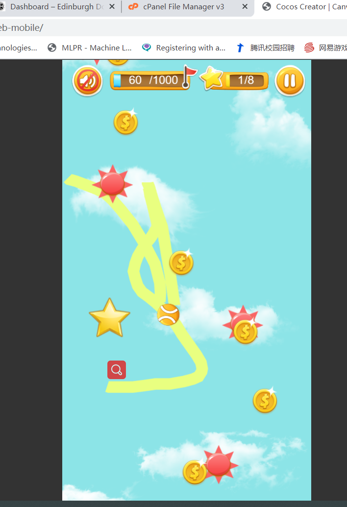

# CanvasBall
和校学工部合作完成助学项目诚信还款的教育活动，设计答题游戏让学生在线参与并进行抽奖。 
因unity在web端表现不好，故使用 cocos creator 制作web游戏前端，使用 php 作为服务端，将 200 道题进行随机抽取让学生进行在线游戏并答题； 
游戏流程中玩家在屏幕上划线，如果球与线有接触，球即会沿着线开始滚动，玩法类似触摸卡比。 
<a href="http://cafel.edinburgh.domains/canvasBall/web-mobile/"><b>点此游玩</b></a> 

I used Cocos Creator to finish this game, and users can play it by using their browse simply. 
Use the mouse to click the screen of your laptop or use your finger to click the screen of your phone to draw a line, and the ball will roll along the line. 
Control the ball to get more coins and starts and keep away with the enemy! 
<a href="http://cafel.edinburgh.domains/canvasBall/web-mobile/"><b>Click here to play</b></a> 

